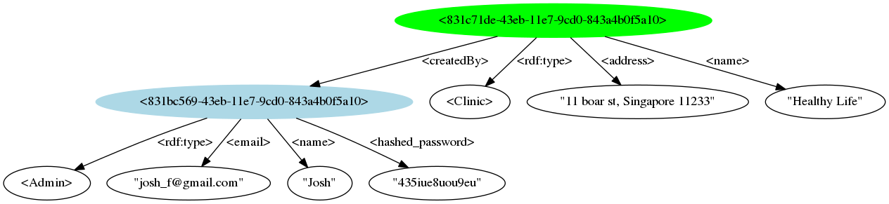

# How-to guide

## How to visualize your data
In the [first guide](../01-insert/README.md) you inserted an admin and a clinic into your BoltDB storage. It's a bit hard to understand the shape of our graph without looking at a diagram that connects the different nodes and edges. Let's see how we can do that with Cayley.

The way to do that is using a software called Graphviz. It's available on all platforms. [Go get it](http://www.graphviz.org/Download..php) and come back after you have it installed. We are waiting for you, so don't worry. You'll know you installed it when running `dot -h` prints the help of Graphviz in your terminal.
Now you are ready to generate a diagram of your database.

Run the following:
```
cayley dump --dbpath "db.boltdb" --db bolt --dump_format=graphviz -o=- | dot -Tpng -ograph.png
```

This command will generate an image file called graph.png. Open it and it should be something similar to this (without the fancy colors):


The green circle is the clinic and the blue is the admin. We call them **subjects**. The other circles are called **objects** and the arrows are called **predicates**. You can also see the `createdBy` edge from the clinic to the admin. You are probably asking yourself a lot of questions and it all sounds a bit confusing. Don't worry about all the details for now. We'll go over it later on probably in a format of a tutorial.

Good job! Now you know how to visualize your datastore. In the future Cayley will have better ways to visualize the data but for now you can use this simple approach.
